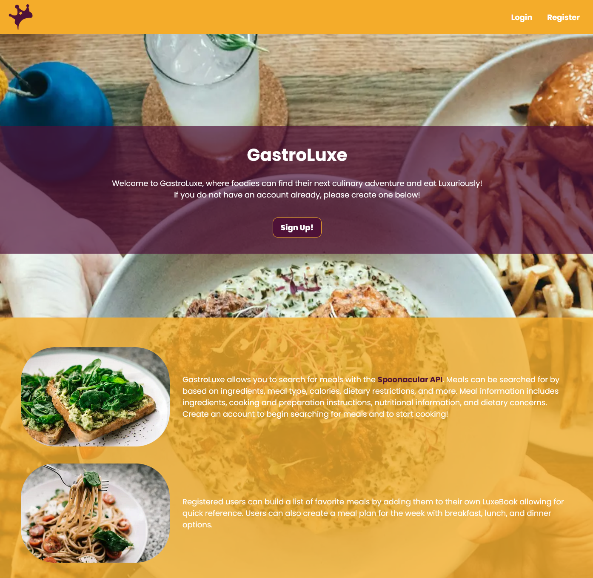

# **::GastroLuxe::** 🥑

## _A Meal Planning App for Luxe Gastrophiles._

This is a [Next.js](https://nextjs.org/) project bootstrapped with [`create-next-app`](https://github.com/vercel/next.js/tree/canary/packages/create-next-app) that allows users to search the [`Spoonacular API`](https://spoonacular.com/food-api) for meals and create a favorites list for quick reference to preferred meals. Users who enjoy organizing their day will also be able to create a meal plan that features breakfast, lunch, and dinner options.

This application is created to help individuals experience and learn about the joy of cooking and how preparing meals at home can help save money, maintain a healthier lifestyle, and the joy of sharing meals with others.



[GastroLuxe Deployment Link](https://gastro-luxe-five.vercel.app/) :: https://gastro-luxe-five.vercel.app/

## Possible Additions

**Social Features:**

- User Ratings/Likes and Comments on Recipe ID Page.
- Reward badges for highly-rated recipes.
- User submitted recipes

**Shopping:**

- Add items to a cart and check out via 3rd party API.
- Real time ingredient prices.

**Extend API Use:**

- Add additional Meal APIs for variety and backup for API limits.

## WIP // TODOS

**TODOs:**

- Added to pages/routes. Some logic/UI features are needed. Such as: meal existence verification/restriction, user email verification (next-auth), meal deletion improvements, modal windows for 'Add to Calendar', and most likely many other things I did not consider or find yet.
- Some additional work is needed for mobile users: icon activation adjustments, calendar view adjustments (accordion style layout for calendar for better interactions and view).

## Getting Started

First, run the development server:

```bash
npm run dev
# or
yarn dev
```

Open [http://localhost:3000](http://localhost:3000) with your browser to see the result.

## Learn More

To learn more about Next.js, take a look at the following resources:

- [Next.js Documentation](https://nextjs.org/docs) - learn about Next.js features and API.
- [Learn Next.js](https://nextjs.org/learn) - an interactive Next.js tutorial.

You can check out [the Next.js GitHub repository](https://github.com/vercel/next.js/) - your feedback and contributions are welcome!

## Contributions

- Feel free to fork or contribute! If using this as base for another project, please don't forget about me. I worked pretty hard on this. Thank you!
